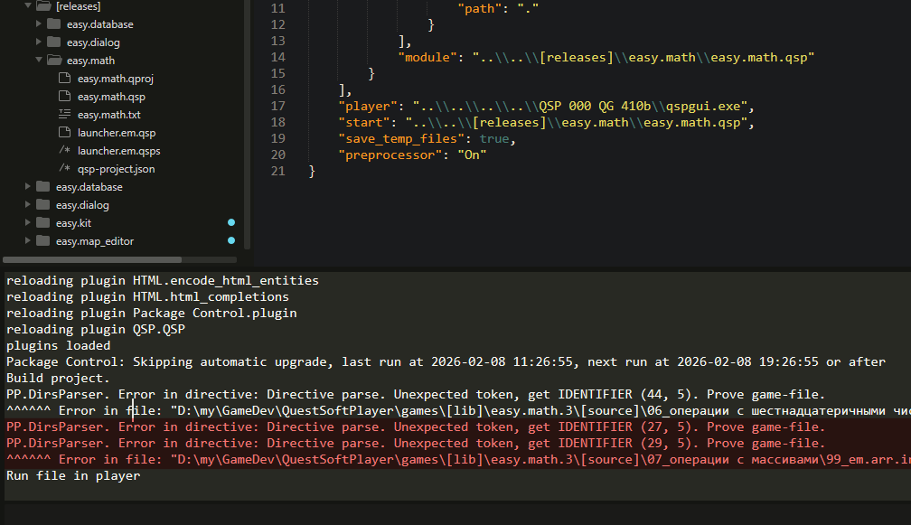

# QSP-Package для Sublime Text

Пакет QSP для редактора Sublime Text включает в себя:
- подсветку синтаксиса для языка QSP,
- встроенный **билдер**, собирающий и запускающий QSP-игры из файлов-исходников,
- а так же наборы сниппетов, инструментов работы с проектом и другие элементы, облегчающие разработку игр на QSP.

>[!tips] Подсказка.
>Если вы не имели дела с Sublime Text, есть краткая пошаговая инструкция по первому запуску игры с нуля: [Краткая инструкция по установке пакета QSP для Sublime Text](siaiz.md)

## Преимущества Sublime Text в сравнении с QuestGenerator 4.0.0

Всем новичкам в разработке игр на QSP я предлагаю начинать с [Quest Generator](https://wiki.qsp.org/help:qgen), так как он удобен, прост и интуитивно понятен: пишешь локации, нажатием на кнопку запускаешь игру — тестируешь.

Тем же, кому не достаёт возможностей Quest Generator, предлагаю воспользоваться более удобным и функциональным редактором Sublime Text.

Вот какие преимущества даёт Sublime Text с установленным в него пакетом QSP:

1. **Исходники**. Разработка игры ведётся исключительно в текстовых файлах (исходниках) формата TXT2GAM (QSPS), что позволяет:
	* Использовать системы контроля версий типа GIT на всех этапах разработки, а значит фиксировать и отслеживать все изменения, вносимые в игру и быстрее находить ошибки.
	* Вести совместную разработку игры с использованием общего репозитория на ресурсах типа GitHub.
	* Проводить поиск по отдельным папкам, файлам, или по всему проекту.
2. **Удобная модульная разработка:** то есть вы можете разбивать игру на сколь угодно большое число частей и подчастей, организовывать эти части по папкам, вкладывая папки друг в друга, или даже хранить некоторые части игры отдельно, а в нужный момент [**билдер**](#QSP-Builder) сам соберёт все нужные файлы "`.qsp`" и запустит игру в плеере по нажатию пары клавиш.
3. **Один редактор — много плееров**. Вы можете завести несколько [файлов проекта](#projectjson), каждый из которых будет ориентирован на сборку и запуск игры в определённом плеере, что позволит вам разрабатывать игру сразу под несколько плееров.
4. **Работа с файлами ресурсов**. Sublime Text из коробки умеет подсвечивать CSS, HTML и JavaScript-файлы, что позволяет работать с этими файлами в том же редакторе, в котором вы работаете над основной частью игры.
5. **Расширения**. Вы можете настроить редактор под себя, создавая собственные сниппеты, устанавливая различные вспомогательные плагины и т.д. Например, вы можете установить в Sublime Text [проверку орфографии](https://devmag.ru/sublime-text-3-spellcheck/), или Emmet, облегчающий работу с HTML.
6. **Подсветка кода**. Умеет очень многое:
	* Поскольку текст между локациями не попадает в финальную версию игры, он подсвечивается как комментарий.
	* Распознавание начала и конца локации и соответственно подсветка этих элементов.
	* Подсветка, которую умеет Quest Generator:
		* Подсветка сложных многострочных комментариев.
		* Подсветка строковых констант.
		* Подсветка числовых констант, системных переменных, операторов и функций.
		* Подсветка меток на локации
	* Подсветка вложенных выражений (подвыражений) в строках.
	* Подсветка основных синтаксических ошибок:
		* Лишний `$` перед именами числовых системных переменных или функций.
		* Отсутствие `$` перед именами текстовых системных переменных и функций.
		* Звёздочка `*` перед именем операторов, кроме `*pl`, `*p`, `*nl`, `*clr`.
		* Неверное число операндов у операций типа `+`, `-`, `*`, `<`, `>` и т.д.
		* Подсветка неправильных имён переменных типа `123build`.
		* Разрыв строки кода внутри вложенного выражения.
		* Подсветка лишнего `end`, а так же `else` и `elseif` вне конструкций условий.
		* Подсветка неправильной записи `else` и `elseif` в многострочном условии.
		* Незакрытый многострочный `act`, `loop` или `if` вызывает подсветку элемента "конец локации" или фигурной скобки, как ошибки.
		* Неправильно поставленная запятая.
		* Неверная запись оператора `local` или `set`.
		* Унарный минус перед текстовой переменной.
	* Подсветка HTML-кода в строках и фигурных скобках при вставке тегов `<qhtml>`, `</qhtml>`.
	* Подсветка конструкций неявного вызова, а так же подсветка ошибочной записи таких конструкций.
	* Подсветка команд препроцессора
	* Подсветка операторов многострочных конструкций `act`, `if`, `else`, `elseif`, `loop`, `end`. 
7. **Автоподстановка**. Когда вы начинаете вводить ключевое слово, или уже вводившуюся ранее переменную, появляется список со словами автоподстановки. Если вы используете неявный вызов функции, редактор предложит варианты уже созданных вами локаций, начинающихся с той же буквы.
8. **Предупреждения**. Редактор предупредит вас:
	* если вы укажете для локации название, которое уже существует в проекте
	* если вы укажете метку, которая уже присутствует в файле

## Формат исходных файлов

Ещё на заре появления QSP была создана утилита [TXT2GAM](https://wiki.qsp.org/help:txt2gam), которая позволяет разрабатывать игру в виде текстового файла (исходника) в любом текстовом редакторе, а потом конвертировать исходник в готовый файл игры.

Вкратце. Файлы формата TXT2GAM (исходники) — это обычные текстовые файлы, в которых код QSP записывается по определённым правилам. В данном руководстве данный формат будет называться **форматом qsps** по названию уже общепринятого расширения для подобных текстовых файлов "`.qsps`". Однако файлы формата qsps могут иметь любое иное расширение: "`.txt`", "`.start`" и т.п.

Типичный файл формата qsps выглядит так:

```qsp
# start
!^ в строчке выше записана метка начала локации.
! она состоит из символа решётки и названия локации.
! название можно отделять, а можно не отделять пробелом от решётки

*pl "Здесь вы видите код локации, соответствующий коду
из поля Выполнить при посещении Quest Generator'а."

! последняя строчка, это метка окончания локации
! она должна начинаться с символа - , за которым
! может находиться любой текст. Обычно это снова
! название локации, или сочетание доп символов и
! названия локации 
- start

Весь текст между локациями не попадает в игру


# вторая локация
! BASE
*p "

	В одном qsps-файле можно размещать несколько локаций,
	если это необходимо. Здесь между комментариями
	! BASE и ! END BASE
	размещаются команды, которые будут собираться в базовое
	описание и базовые действия в готовой игре

"
ACT 'Действие в базовых действиях':
	*pl 'Если открыть собранную игру в Quest Generator, вы
	увидите и текст, написанный выше и данное действие
	в соответсвующих полях.'
END
! END BASE
--- вторая локация ---------------------------------
```

Более подробно о том, как пишутся игры на QSP в формате TXT2GAM, вы можете узнать из уроков от ELMORTEM: ["Пишем QSP-игру в текстовом редакторе"](https://wiki.qsp.org/help:txt2gam_manual).

### Кодировка

Непосредственно сами файлы QSP ("`.qsp`") имеют кодировку **utf-16le**, тогда как билдер работает исключительно с файлами в кодировке **utf-8** (без BOM-символов). Чтобы билдер собирал игру правильно, исключительно важно, чтобы все qsps-файлы вашего проекта имели кодировку **utf-8**. Будьте аккуратны при использовании спецсимволов, проверяйте соответствие в исходном и конечном файле.

## Установка пакета QSP для Sublime Text

0. Прежде всего у вас должен быть установлен Sublime Text, желательно Sublime Text 4. Скачать его можно отсюда https://www.sublimetext.com/download.

### Установка для пользователей Windows

Данная инструкция ориентирована на пользователей, которые скачают последний релиз со страницы релизов. Установка из исходников будет немного отличаться.

1. Скачайте установочный файл из [последнего релиза](https://github.com/AleksVersus/JAD_for_QSP/releases). Файл будет называться "`install.QSP.sublime-package.XX.exe`", где `XX` — номер версии.
2. Запустите установочный файл и следуйте инструкциям — пакет установится автоматически.
3. При желании скачайте и распакуйте в отдельную папку архив "`manual and examples.zip`", в котором содержится текущая инструкция и различные примеры проектов.

### Установка из исходников

1. Скачайте архив "`QSP.sublime-package.src.zip`" из [последнего релиза](https://github.com/AleksVersus/JAD_for_QSP/releases).
2. Откройте Sublime Text и откройте папку с установленными пакетами: пункты меню `Preferences → Browse Packages...`
3. В открытую папку извлеките из архива "`QSP.sublime-package.src.zip`" папку "`QSP`". При необходимости замените файлы.

> [!warning] **Важно!**
> **Перезагрузите Sublime Text после установки пакета!**

## Удаление пакета QSP из Sublime Text

0. Откройте Sublime Text и откройте папку с установленными пакетами: пункты меню `Preferences → Browse Packages...`

### для пользователей Windows

1. Откройте папку QSP и запустите программу `unins000.exe`
2. Следуйте инструкциям.
3. Если папка QSP не удалится, или удалится не полностью, её можно удалить вручную.

### для пользователей, устанавливавших из исходников

1. Удалите папку QSP

> [!warning] **Важно!**
> **Перезагрузите Sublime Text после удаления пакета!**

## Состав пакета QSP для Sublime Text

### QSP-Builder

QSP-Builder (далее QBST, билдер) — это встроенный в пакет QSP плагин, который:

1. собирает из разрозненных файлов формата qsps один цельный файл игры в формате qsps;
2. конвертирует полученный qsps-файл в файл игры в формате "`.qsp`" (QSP-файл);
3. запускает указанный файл игры в стандартном или выбранном плеере QSP.

Возникающие при сборке ошибки выводятся в консоль. Консоль открывается сочетанием клавиш `[Ctrl + ~]`.

#### Порядок работы с проектом игры на QSP

1. Проект организуется по папкам. В корневой папке проекта должен лежать файл "`qsp-project.json`", который и содержит в себе инструкции по сборке проекта (см. раздел [**qsp-project.json**](#qsp-projectjson)).
2. Все рабочие файлы проекта пишутся в формате qsps и сохраняются с расширением "`.qsps`". В качестве исключения можно указывать иные расширения, но в таком случае необходимо будет указывать пути до конкретных файлов (см. раздел "**[qsp-project.json](qsp-projectjson)**").
3. После редактирования и сохранения файлов можно выбрать [один из режимов сборки](#Порядок-сборки-и-запуска).
4. Если вы откроете какой-либо файл qsps в отдельном окне Sublime Text и запустите билдер, этот файл будет собран, как отдельная игра. При этом файл игры появится рядом с файлом qsps, а так же рядом будет создан файл `qsp-project.json`.
5. При работе с несколькими папками в одном окне — каждая папка будет являться отдельным проектом игры на QSP.
	- Если в самой первой папке нет файла `qsp-project.json`, при этом ни один файл не открыт, билдер соберёт игру из всех файлов qsps, которые найдёт в первой папке. Игра и файл `qsp-project.json` будут созданы в этой же папке.
	- Если открыт файл из папки, в которой нет `qsp-project.json`, игра соберётся из всех qsps-файлов этой папки.
	- Исключением из двух этих случаев является ситуация, когда файл "`qsp-project.json`" лежит не в открытой в Sublime Text папке, а — в подпапке. И в той же подпапке, или уровнем ниже, лежит открытый в Sublime Text файл, на котором вы запускаете билдер.
6. Если вы запустите сборку проекта на открытом файле "`qsp-project.json`", билдер просто соберёт проект на основе этого файла. Таким образом вы можете держать несколько файлов `qsp-project.json` в подпапках и собирать на их основе разные версии игр.<br>Например, вы разрабатываете игру для классического плеера и в корневой папке у вас создан `qsp-project.json` для сборки игры под классический плеер, а в одной из подпапок лежит `qsp-project.json`, благодаря которому вы можете периодически собирать игру для qSpider, и проверять, как она будет работать в нём.

Как пример работы с проектом рассмотрим структуру моей игры "*fantastic battles*", которую я писал в Quest Generator.

В этом проекте пришлось разбить игру на отдельные модули для удобства разработки, и всего таких модулей получилось четыре:

* "`fb_v.0.2.qsp`" — основной файл игры, в котором подключаются все прочие файлы модулей
* "`intro.qsp`" — модуль вводных данных игры
* "`drive.qsp`" — основной движок игры
* "`bases.qsp`" — различные базы исходников для игры

Каждый из этих файлов может содержать множество локаций, поэтому для самих файлов ведутся файлы "`.qproj`", которые содержат псевдопапки. Например, в "`fb_v.0.2.qsp`" локации разбиты на псевдопапки:

-	 	 "`[start]`" — стартовая локация без папки
-	"`системное меню`" — папка с локациями основного меню
	-	"`[1.0_game_start]`" — локация, запускающая игру
	-	"`[0.1_game_info]`" — локация с информацией об игре
-	"`локации места`" — папка локаций места, и собственно локации:
	-	"`[м:0]_общий_вид_локации_места`"
	-	"`[м:1]_дом`"
	-	"`[м:2]_улица`"
	-	"`место;стандартная_кухня`"
-	"`обязательные локации`" — папка стандартных локаций для этой игры
	-	"`[chest]`" — сундуки
	-	"`[death]`" — смерть
	-	"`[help]`" — помощь

Работая в редакторе типа Sublime Text, я могу не только разбить данный файл игры на отдельные файлы и разместить их по папкам, но каждую локацию писать в отдельном файле. Я могу создавать подпапки и т.д., а потом собирать те же четыре файла из разрозненных qsps-файлов.

В данном случае я бы выделил отдельную папку под каждый модуль, в том числе — под основной файл игры. Допустим так:

- "`[game]`" — папка с основным файлом игры
    - "`start.qsps`" — файл со стартовой локацией
    - "`системное меню`" — папка с локациями системного меню
        - "`sysmenu.qsps`" — обе локации системного меню в одном файле
    - "`локации места`" — папка для локаций мест, можно дополнить другими папками
        - "`стандартные места`" — папка для стандартных локаций мест
            - "`общий вид локации места.qsp-txt`" — файл с локацией "`[м:0]_общий_вид_локации_места`"
            - "`кухня.qsps`" — файл с локацией "`место;стандартная_кухня`"
		- "`дом.qsps`" — файл с локацией "`[м:1]_дом`"
		- "`улица.qsps`" — файл с локацией "`[м:2]_улица`"
	- "`обязательные локации`" — папка с файлами обязательных локаций
		- "`chests.qsps`" — файл с локацией "`[chest]`"
		- "`death and help.qsps`" — файл с локациями "`[help]`" и "`[death]`"

> [!warning] **Необходимо отметить**,
> что при сборке конечного файла из таких разрозненных файлов, к конечному файлу добавляются сначала локации из файлов, которые лежат в папках верхних уровней, затем файлы из папок нижних уровней. Таким образом локация из файла "`start.qsps`" окажется в самом верху списка локаций при создании файла "`.qsp`". Это особенно важно учитывать, если вы пользуетесь возможностями препроцессора.

#### qsp-project.json

Пример с комментариями представлен в файле "`_disdocs\example.json`" (см. на [гитхабе](https://github.com/AleksVersus/JAD_for_QSP/blob/master/_disdocs/example.json)).

Как видно из расширения, проект представляет собой JSON-файл. Это значит, что вся его структура состоит из JSON-объектов (в Python - это словари) и JSON-массивов (в Python - это списки). Немного более подробно о файлах формата JSON Вы можете прочитать здесь: [hostinger.ru/rukovodstva/chto-takoe-json](https://www.hostinger.ru/rukovodstva/chto-takoe-json).

Пока же для краткости скажем:
- JSON-объекты записываются в фигурных скобках и состоят из элементов вида ключ-значение, разделённых запятыми. Между ключом и значением обязательно ставится двоеточие, за последним элементом ни в коем случае нельзя ставить запятую. Ключ — всегда записывается с использованием кавычек, то есть это всегда строка.
- JSON-массивы записываются в квадратных скобках, в которых через запятую перечисляются значения. За последним значением ни в коем случае не ставится запятая. Значениями могут быть числа, строки, другие объекты и массивы.

В данном случае корневым элементом является объект, в котором присутствуют восемь элементов:

```json
"project":[],
"start":"startgame.qsp",
"converter":"C:\\Program Files\\QSP\\txt2gam.exe",
"player":"C:\\Program Files\\QSP\\qsp580\\qspgui.exe",
"save_temp_files": true,
"preprocessor":"Off",
"assets":[],
"scans":{}
```

Обязательно нужно указать элементы "project" и "start".

Нужно так же указать элемент "player", поскольку прописанный в билдере путь может не соответствовать действительному пути к плееру, установленному у вас в системе.

Остальные элементы указывать не обязательно.

##### project

Значением элемента "project" является массив однотипных объектов ("билдов"), в которых присутствуют следующие элементы:

```json
"module": "output_file.qsp",
"files": [],
"folders": [],
"start_qsploc_file": "start_game.qsps"
```

Элемент "module" содержит путь к конечному файлу "`.qsp`", который мы хотим получить. Этот файл мы в дальнейшем будем называть просто "модуль".

Элементы "files" и "folders" содержат массивы однотипных объектов. И в том и в другом случае объекты содержат элементы "path", однако для "files" каждый элемент "path" содержит путь к конкретному файлу, из которого мы должны получить локации, а для "folders" каждый элемент "path" содержит путь к папке, и уже из этих папок выбираются файлы "`.qsps`".

```json
"files": [
	{"path":"D:\\my\\projects\\01_меню.qsp-txt"},
	{"path":"game.qsp-txt"}
],
"folders": [
	{"path": "."},
	{"path": "D:\\my\\projects\\Вопросы"},
	{"path": "projects\\Вопросы"}
]
```

Из элементов "files" или "folders" должен присутствовать хотя бы один.

Элемент "start_qsploc_file" позволяет указать путь к файлу "`.qsps`", локации из которого будут добавлены в начало собираемого модуля. Указать можно только путь к файлу, который указан в элементе "files", или находится в одной из папок, перечисленных в элементе "folders", включая подпапки.

##### start

Значением элемента "start" является путь к модулю, который необходимо запускать в плеере после билда. Это не обязательно должен быть один из собранных файлов, т.е. указать можно абсолютно любой файл "`.qsp`".

```json
"start": "startgame.qsp"
```

##### converter

Значением элемента "converter" является путь к утилите, конвертирующей файлы формата qsps в файлы "`.qsp`". В QBSP уже встроен собственный конвертер, поэтому данный элемент можно не использовать.

Если же вы используете внешний конвертер, его API должен соответствовать API консольной утилиты TXT2GAM.

- Скачать утилиту TXT2GAM можно отсюда: [QSP.su/Разработчикам/TXT2GAM](https://qsp.org/index.php?option=com_content&task=view&id=52&Itemid=56)

Можно просто указать путь до конвертера:

```json
"converter": "C:\\Program Files\\QSP\\txt2gam.exe"
```

Можно указать путь и параметры, которые вам необходимы:

```json
"converter": ["C:\\Program Files\\QSP\\txt2gam.exe", "-pMyPass -u"]
```

Как видно из последнего примера, внешний конвертер может позволить поставить пароль на модуль, или сохранить его в иной кодировке.

##### player

Значением элемента "player" является путь к плееру, в котором необходимо запустить игру (например, после сборки).

- Различные плееры лежат здесь: [QSP.su/Плееры](https://qsp.org/index.php?option=com_content&view=article&id=64&Itemid=87)

```json
"player": "C:\\Program Files\\QSP\\Quest Navigator\\QuestNavigator.exe"
```

В билдере прописан стандартный путь к одной из последних версий QSP, однако он скорее всего будет отличаться от пути плеера, установленного у вас в системе.

##### save_temp_files

Элемент "save_temp_files" разрешает оставлять промежуточные файлы после сборки (т.е. рядом с каждым собранным файлом "`.qsp`" будет лежать его исходник в формате qsps с раcширением "`.txt`"). 

Элементу можно назначать значения `true` и `false`. Значением по умолчанию является `false`.

```json
"save_temp_files": true
```

##### preprocessor

Элемент "preprocessor" позволяет включать и выключать препроцессор при сборке файлов. Подробнее см. раздел [**Препроцессор**](#препроцессор). Ему можно назначать значения:

- `"On"`
- `"Off"` (значение по умолчанию)
- `"Hard-off"`

```json
"preprocessor": "On"
```

##### assets

Данный элемент позволяет копировать различные ресурсы из разных источников в папку с собранной игрой. Например, удобнее вести css-файлы рядом с исходниками игры, и запускать билд горячими клавишами, при этом нужно, чтобы свежие файлы css при сборке подтягивались в папку с готовой игрой. Вот для таких случаев и предназначен данный параметр.

Значением элемента "assets" является массив однотипных объектов ("ресурсов"), в которых присутствуют следующие элементы:

```json
"output": "..\\[output]\\assets",
"files": [],
"folders": [],
```

Элемент "output" содержит путь к папке, *в который мы хотим разместить* перечисленные ресурсы.

Элементы "files" и "folders" содержат массивы однотипных объектов. И в том и в другом случае объекты содержат элементы "path", значениями которых являются пути к файлам и папкам, которые мы хотим скопировать. Пути нужно прописывать относительно файла "`qsp-project.json`".

```json
"folders": [
	{"path": ".\\assets\\css"},
	{"path": ".\\assets\\img"}
],
"files": [
	{"path": ".\\assets\\css_1\\extras.css"}
]
```

При отсутствии элементов "files" и/или "folders" и элемента "output" копирование файлов производиться не будет.

> [!danger] **Внимание!!!**
> Папки и файлы перезаписываются полностью! Будьте аккуратны и всегда сохраняйте резервные копии всех файлов.

> [!warning] **Учтите**
> Если вы используете большое количество ресурсов в своей игре, копировать постоянно всё не имеет смысла. Используйте ключ "output" при первом копировании, затем замените его на "output_" для тех папок и файлов, которые не требуется постоянно перезаписывать. Оставьте полное копирование только для тех ресурсов, которые изменяете постоянно.

##### scans

Элемент "scans" должен содержать объект, состоящий из трёх элементов: "location", "files", "folders". Из элементов "files" и "folders" должен присутствовать хотя бы один элемент.

```json
"scans": {
	"location": "prv_file",
	"folders": [],
	"files": []
}
```

При наличии "scans" в первый создаваемый *модуль* будет встроена локация-функция, сгенерированная автоматически. Во время генерации в эту локацию будут прописаны пути ко всем существующим файлам, перечисленным в элементе "files", и ко всем файлам, которые находятся в папках, перечисленных в элементе "folders". Таким образом данная локация позволит проверять наличие того или иного файла прямо из кода вашей игры. Механизм, обеспечивающий проверку, уже встроен в эту локацию, и возвращает `1`, если файл существует, и `0` — если файл не существует.

* Элемент "location" нужен, чтобы указать название локации, которое вы хотите использовать в своей игре. По умолчанию локация будет называться "prv_file".
```json
"location": "prv_file"
```
* Элемент "files" содержит непосредственно пути к файлам (в виде массива), наличие которых требуется проверять.
```json
"files": [
	"..\\example_game\\res\\img\\scl\\scale-green-leo.bmp",
	"..\\example_game\\res\\img\\scl\\scale-space-leo.bmp",
	"..\\example_game\\res\\img\\scl\\scl.rainbow.gif"
]
```
* Элемент "folders" содержит непосредственно пути к папкам (в виде массива), из которых выбирается список всех файлов, наличие которых требуется проверять.
```json
"folders":[
	"..\\example_game\\res\\img\\diary",
	"..\\example_game\\res\\img\\drive",
	"..\\example_game\\res\\img\\ico",
	"..\\example_game\\res\\img\\obj"
]
```

> [!warning] **Обратите внимание!!!**
> **В файле "`qsp-project.json`" все пути указываются относительно его расположения**, но в генерируемой локации все пути будут сгенерированы относительно файла, прописанного в элементе ["start"](#start).

> [!warning] Так же **обратите внимание**,
> Что локация будет добавлена к модулю, прописанному в элементе "start". Если в элементе "start" путь к модулю не указан, локация будет добавлена к первому созданному модулю.

Пример проверки пути в QSP версии 5.8.0 и выше:

```qsp
if @prv_file('res\img\ico\p.gif'):
	"Файл существует"
else:
	"Файл не существует"
end
```

> [!note] Примечание:
> Билдер сначала производит копирование файлов, указанных в элементе "assets", и лишь затем генерирует локацию, сканируя пути к файлам. То есть в игре можно проверять наличие файлов, которые перед сборкой ещё отсутствовали в папке с игрой.

#### Пути

Элементы "start", "module", "path" и другие должны содержать абсолютные или относительные пути к файлам или папкам.

Относительные пути обсчитываются относительно расположения файла "`qsp-project.json`" и записываются по следующим правилам:

1. Разделителем между папками/файлами в пути выступает обратный слэш, однако он должен быть проэкранирован дублированием:
	`"lib\\easy.dialog\\mod.qsp"`
2. Путь не должен начинаться с разделителя (двойной обратный слэш):
	* так писать можно: `"lib\\easy.dialog\\mod.qsp"`
	* так писать нельзя: `"\\lib\\easy.dialog\\mod.qsp"`
3. Указание на текущую папку (в которой лежит "qsp-project.json") производится через точку:
	`"."` - текущая папка
4. Допускается указание текущей папки через точку и относительный путь от этой папки:
	`".\\lib"` — вложенная в текущую папку папка "lib". Равносильно такой записи:
	`"lib"`
5. Используя две точки можно указать папку выше текущей:
	`".."` — папка, в которую вложена текущая
6. Можно указывать папки на несколько уровней вверх, указывая через двойной бэкслэш две точки для каждого уровня:
	* `"..\\.."` — на два уровня выше текущей
	* `"..\\..\\.."` — на три уровня выше текущей
7. Можно так же указывать папки относительно папок, расположенных выше текущей:
	* `"..\\export"` — папка "export", размещённая в одном каталоге с текущей.
	* `"..\\..\\project\\other_game\\lib"` — два уровня вверх, и от этой папки в "`project\other_game\lib`".

#### Пример проекта

В папке "`_disdocs\example_project`" есть пример *разобранного* проекта. Почти все локации разнесены по отдельным файлам и разбросаны в разные папки по функционалу и тематике. Если считать "`_disdocs\example_project`" за корень, то в корне размещён, помимо остальных папок, файл "`qsp-project.json`", который и определяет порядок сборки основного файла игры и файлов модулей.

Попробуйте сделать билд этого проекта, если сомневаетесь, что правильно поняли, как работает билдер. При сборке данного проекта в папке "`_disdocs\example_game`" будут созданы основной файл игры "`game.sam.qsp`" и файлы различных модулей. Не забудьте прописать свой путь к плееру для правильного запуска. Если Вы используете режим **Build and Run**, файл "`game.sam.qsp`" будет запущен в плеере.

Проект адаптирован под плеер версии 5.8.0. В более старых версиях работать не будет. В 5.8.0 могут присутствовать ошибки в логике некоторых алгоритмов. Пока что я этим проектом не занимаюсь. Возможно, в будущем переведу его на новую версию движка и это будет полноценная демка.

#### Порядок сборки и запуска

Для удобства определены три режима работы QBST:

* **Build and Run** — сборка и запуск. Собрать файлы согласно инструкции и запустить стартовый файл в плеере. Запускается сочетанием `["ctrl+f5"]`. (**QSP**)
* **Build** — исключительно сборка. Cобрать файлы согласно инструкции и сконвертировать в "`.qsp`". Запускается сочетанием `["ctrl+alt+q"]`. (**QSP - qsp-build**)
* **Run** — исключительно запуск. Запустить стартовый файл, указанный в проекте "`qsp-project.json`", в плеере. Запускается сочетанием `["ctrl+alt+s"]`. (**QSP - qsp-run**)

У каждого из режимов есть свои особенности.

"**Build and Run**" отличается тем, что в этом режиме обязательно собираются заново все файлы "`.qsp`", определённые инструкциями "`qsp-project.json`", затем, если в инструкциях неверно указан, или не указан, файл "`.qsp`", который следует запустить (элемент "start"), запускается самый первый определённый инструкциями собранный файл "`.qsp`".

"**Build**" отличается тем, что в этом режиме происходит новая сборка всех файлов "`.qsp`", определённых инструкциями "`qsp-project.json`", и больше ничего.

"**Run**" — в этом режиме не производится новая сборка файлов "`.qsp`", но запускается в плеере тот файл "`.qsp`", который указан в "`qsp-project.json`" в элементе "start".

##### Сборка с помощью конвертера qsps_to_qsp или внешнего конвертера

Конвертер **qsps_to_qsp** является составной частью плагина, но начиная с версии 0.15 пакета QSP на Windows по умолчанию используется сторонний конвертер QGC, ускоряющий сборку проекта в несколько раз, особенно при больших объёмах исходных файлов.

Если вы хотите, чтобы ваша игра всегда собиралась средствами встроенного конвертера **qsps_to_qsp**, укажите его в элементе "converter" файла "`qsp-project.json`":

```json
"converter": "qsps_to_qsp"
```

Если указать в этом элементе путь к другой программе конвертеру (внешний конвертер), порядок сборки будет таким же.

При сборке содержимое файлов формата qsps добавляется в результирующий файл в следующем порядке:

1. Файл, путь до которого указан в элементе "start_qsploc_file".
2. Файлы, перечисленные в массиве элемента "files", по порядку. Таким образом самыми первыми в файле "`.qsp`" оказываются локации из самого первого файла в элементе "files".
3. Файлы "`.qsps`", содержащиеся в папках, перечисленных в массиве элемента "`folders`" по порядку, независимо от уровня вложенности. Т.е. если у нас перечислены по порядку папки "`1`", "`2`" и "`3`", то сначала в результирующий файл добавятся локации из папки "`1`" и всех её вложенных папок, затем из папки "`2`" и всех её вложенных папок, затем из папки "`3`" и всех её вложенных папок. При этом первыми всегда добавляются файлы самого верхнего уровня, а потом с более глубоких уровней вложенности. Это особенно важно учитывать, если Вы используете препроцессор.
4. Перед конвертированием, если включена обработка препроцессором, данные будут дополнительно обработаны встроенным в билдер препроцессором.

##### Сборка с помощью QSP Game Converter (QGC)

Начиная с версии 0.15 пакета QSP для Sublime Text на Windows по умолчанию используется сторонний конвертер **QGC**, ускоряющий сборку проекта в несколько раз, особенно при больших объёмах исходных файлов. При сборке проекта с помощью **QGC** результат будет отличаться от описанного в разделе выше.

Чтобы локации из определённого файла оказались в самом начале модуля/игры, укажите путь к этому файлу в элементе "start_qsploc_file". Если такой элемент определён не будет, порядок файлов будет определён нижеследующим образом.

Если для отдельного модуля перечислены файлы в элементе "files", то самой первой локацией в модуле окажется локация первейшего из перечисленных файлов.

Если файлы в элементе "files" не перечислены, однако перечислены папки в элементе "folders", самым первым станет файл (и соответствующая локация) на верхнем уровне первейшей папки, или в первейшей из вложенных папок (см. пункт 3 в разделе выше).

Все остальные локации будут отсортированы конвертером по алфавиту.

При сборке в этом режиме временные файлы не сохраняются, т.е. параметр 'save_temp_files' не имеет значения.

##### Упрощённый запуск

Упрощённый запуск — это запуск игры без "`qsp-project.json`", а вернее: "`qsp-project.json`" при этом будет создан автоматически.

Тогда, если исходник игры "`.qsps`" открыт в отдельном окне, или не принадлежит ни одной из открытых папок, он будет собран и запущен, как самостоятельная игра.

Подобный запуск удобен, когда вам нужно быстро протестировать небольшой фрагмент кода, а создавать целый проект под это нет смысла: вы можете просто написать исходник, сохранить его вне любого проекта игры, и запустить одним из вышеперечисленных способов.

#### Ошибки

Начиная с версии 0.10 некритические ошибки выводятся в консоль Sublime Text.

Ошибки в консоли могут иметь следующий вид, что значит, что ошибка в работе самого плагина, или в написанном исходнике игры:

```python
Traceback (most recent call last):
  File "D:\my\GameDev\QuestSoftPlayer\projects\JAD\QBST\main.py", line 72, in <module>
    qsp.constructFile(build_files,exit_txt)
  File "D:\my\GameDev\QuestSoftPlayer\projects\JAD\QBST\function.py", line 44, in constructFile
    file.write(text)
  File "C:\Program Files\Python39\lib\encodings\cp1251.py", line 19, in encode
    return codecs.charmap_encode(input,self.errors,encoding_table)[0]
UnicodeEncodeError: 'charmap' codec can't encode character '\u2191' in position 29347: character maps to <undefined>
```

В данном случае ошибка показывает, что имеются проблемы с декодированием. Сообщайте о подобных ошибках письмом на почту lex666endless@gmail.com.

> [!warning] **ВНИМАНИЕ!!!**
> Если вы столкнулись с тем, что билдер собирает вашу игру не полностью (т.е. некоторые локации не попадают в итоговую версию игры), выставьте параметр "save_temp_files" в значение "True" и посмотрите в промежуточном текстовом файле, какая локация последней попадает в итоговую версию. Где-то с 99% вероятностью следующая за ней локация написана неправильно (например, не закрыта кавычка или фигурная скобка), исправьте эту локацию в исходниках и затем снова запустите билд. Скрипт, равно как и утилита TXT2GAM, конвертирует игру любого объёма, хоть тысяча локаций, хоть тридцать тысяч, если они написаны соответственно формату qsps.

#### Препроцессор

Препроцессор - это набор команд предобработки исходного текста программы перед компиляцией. В нашем случае, до того, как мы сконвертируем файлы проекта в конечные файлы "`.qsp`", мы можем исключить из этих файлов некоторые строки, или рекомбинировать их.

Препроцессор написан с нуля, поэтому будут баги и логические ошибки в работе команд. Я ни разу не пользовался сторонними препроцессорами, поэтому могу изобрести велосипед там, где все гоняют на Kawasaki z900. Будьте аккуратны и делайте побольше коммитов.

> [!warning] Внимание
> **При препроцессинге билдер работает в несколько раз медленнее.**

##### Cинтаксические правила

###### Общее

1. Все команды препроцессора (директивы), а так же спец-комментарии являются обычными комментариями с точки зрения синтаксиса QSP и не влияют на логику вашего кода.
2. Директивы препроцессора (далее "директивы") записываются в отдельных строках кода, однако допускается преформатирование, т.е. отступы в начале строки перед директивой.
3. Спец-комментарии записываются, как обычные комментарии QSP, в т.ч. они могут быть многострочными.
4. Спец-комментарии не учитываются внутри строк, фигурных скобок, а так же в конце обычных комментариев.
5. Директивы, записанные внутри строк и фигурных скобок, валидны и нормально работают.
6. Директивы записанные в многострочных комментариях не валидны и являются частью комментария.
7. Невалидная директива воспринимается препроцессором, как спец-комментарий.
8. Блоки условий, образованные директивами препроцессора, вкладывать друг в друга нельзя.
9. Имена меток и значений могут содержать только числа, буквы и символ подчёркивания, и не должны совпадать с ключевыми словами директив препроцессора.
10. Имена меток и ключевые слова регистрозависимы. `NoSaveComm` и `nosavecomm` — разные слова. Первое может быть именем метки, а второе только ключевым словом директивы препроцессора.

###### Спец-комментарии

* `!@` — комментарий, начинающийся с такого сочетания символов, будет удалён при препроцессинге. (простой спец-комментарий)
* `!@<` — комментарий, начинающийся с такого сочетания символов, а так же строка, в которой стоит этот комментарий, будут удалены при препроцессинге. (спец-комментарий с удалением)

###### Директивы

В начале каждой директивы записывается ключ `!@pp:`.

* `!@pp:on` — включает препроцессор до конца файла, или до специального отключения. Эта команда будет работать только в режимах "On" и "Off". См. раздел [Включение препроцессора](../../README.md#Включение%20препроцессора).
* `!@pp:off` — выключает препроцессор до конца файла. Будет работать только в режимах "On" и "Off". См. раздел [Включение препроцессора](<../../README.md#Включение препроцессора>)
* `!@pp:savecomm` - данная команда **отключает** обработку специальных комментариев. То есть и специальные комментарии и те строки, которые помечались такими комментариями под удаление не будут удаляться. Действует до конца файла.
* `!@pp:nosavecomm` - данная команда **включает** обработку специальных комментариев. Действует до конца файла.
* `!@pp:var(name=123)` - данная команда объявляет метку *name* со значением **"123"**. Имена меток и значения могут содержать только числа, буквы и символ подчёркивания. Допустимо объявлять метку без указания значения: `var(layer)`.
* `!@pp:if(name==123):exclude` - данная команда проверяет, выполняется ли условие в скобках (содержит ли метка *name* значение **"123"**), и если условие выполняется, исключает нижеследующие строки кода из конечного файла. Вместо слова `exclude` можно использовать другие ключевые слова (в любых комбинациях через пробел):
	* `exclude` — **исключить** последующие строки **из конечного файла** при выполнении условия. Если условие не выполнено, строки будут обработаны препроцессором и включены в конечный файл.
	* `include` — последующие строки должны быть **включены в конечный файл** при выполнении условия, при этом строки будут обработаны препроцессором. Если условие не будет выполнено, строки не будут включены в конечный файл.
	* `off` - выключить препроцессор до конца блока условия. При этом не будут обрабатываться директивы и спец-комментарии.
	* `on` - до конца блока условия, даже если строки исключаются из файла, они будут обработаны препроцессором, т.е. выполнятся все директивы внутри блока условия.
	* `savecomm` — не обрабатывать специальные комментарии.
	* `nosavecomm` — обрабатывать специальные комментарии.
	Можно комбинировать ключевые слова (например, `exclude off` и `include off`).
	Содержимое скобок при проверке условия может содержать следующие операции (в порядке повышения приоритета):
	* `or` — логическое **ИЛИ**. Проверка верно ли хотя бы одно условие.
	* `and` — логическое **И**. Проверка, верны ли оба условия одновременно.
	* `not` — логическое **НЕТ**. Верно, если выражение неверно.
	* `==` — проверка равны ли два значения. Верно если равны.
	* `!=` — проверка не равны ли два значения. Верно если не равны. Приоритет такой же, как у `==`.
* `!@pp:endif` - данная команда указывает окончание блока условия.

##### Некоторые особенности работы

1. Препроцессор не просто вырезает и вставляет строки, он фактически разбирает ваш код на составляющие, а потом по новой собирает его. Будьте внимательны, некоторые пробелы между операторами, разделёнными `&` могут пропасть.
2. Все команды препроцессора удаляются из конечного файла при препроцессинге. Есть исключения, когда обработка отключается по вашему желанию.
3. Специальные комментарии не будут обрабатываться, если они размещены внутри кавычек или фигурных скобок.
4. Команды препроцессора будут выполняться даже в том случае, если они размещены внутри строковых значений QSP, если записаны согласно требованиям синтаксических правил:
```qsp
*pl "Текстовое значение, разбитое на несколько строк
!@pp:if(layer):exclude
Данные строки будут исключены из конечного файла,
если метка layer была определена.
!@pp:endif
А эта строка останется в конечном файле"
```
5. Все объявленные метки будут глобальны для всего проекта. Будьте внимательны при организации работы препроцессора.
6. ВЛОЖЕННОСТЬ БЛОКОВ УСЛОВИЙ НЕ ПОДДЕРЖИВАЕТСЯ!
7. `True` и `False` — это метки, которые определены заранее по умолчанию. Их нельзя переопределить. Используются, как значения для проверки существования метки: `if(build_em!=True)` или `if(build_em==False)`. Однако рекомендую проверять наличие метки, написав просто: `if(build_em)`.
8. При обработке препроцессором все строки между локациями убираются из конечного файла. Это немного ускоряет конвертирование при сборке.
9. Если вы используете многострочные текстовые значения в команде QSP, а в конце записан спец-комментарий с удалением, удалится не только строка с таким спец-комментарием, но и вся команда.
10. Даже в режиме "Off" препроцессор продолжает обрабатывать файлы, поэтому могут пропадать пустые строки в коде локаций.

##### Включение препроцессора

1. Включить препроцессор сразу для всего проекта можно, указав в "`qsp-project.json`" значение "`On`":
	```json
	"preprocessor": "On",
	```
	При этом абсолютно все файлы будут подвергаться препроцессингу, в т.ч. исходники модулей. Всё, что собирается проектом, будет обработано перед сборкой. Исключение составляют файлы, для которых препроцессинг отключается командой `!@pp:off`.
2. Включить препроцессор только для одного файла можно командой:
	```
	!@pp:on
	```
	Если препроцессор выключен выставлением режима "`Hard-off`", данная команда работать не будет.

##### Выключение препроцессора

1. Для всего проекта можно использовать значение в "`qsp-project.json`" (режим "`Off`"):
	```json
	"preprocessor":"Off",
	```
	Данное значение является значением по умолчанию, поэтому его можно не указывать. При этом код, поставленный в обработку командой `!@pp:on`, всё равно будет обрабатываться препроцессором.
2. Другое значение, полностью исключающее препроцессинг проекта (режим "`Hard-off`"):
	```json
	"preprocessor": "Hard-off",
	```
	Данное значение отключает препроцесинг абсолютно для всех файлов, даже если в файлах проставлены команды `!@pp:on`. В этом режиме у пользователей *Windows* сборка будет осуществляться с помощью конвертера "`QGC.exe`", что значительно ускорит получение конечного файла игры и запуск в плеере. **Строго рекомендуется выставить данное значение, если пользуетесь Windows и ваша игра находится на стадии разработки**.
3. В режиме "`On`" можно отключать препроцессинг до конца файла следующей командой:
	```
	!@pp:off
	```

##### Ошибки при работе препроцессора



На скриншоте выше видно, что препроцессор выводит в консоль список ошибок, которые вы допустили при написании директивы, или если нарушен базовый синтаксис QSP на локации. В основном вы будете видеть ошибки вроде тех, что показаны на скриншоте. Под списком ошибок указывается название файла, в котором они были допущены.

В зависимости от типа ошибки вы можете увидеть одну из рекомендаций:
- Если проблема с файлом игры, препроцессор рекомендует '**Prove game-file**'.
  В некоторых типах ошибок указывается в какой строке и символе стоит поискать проблему: `(44, 5)` — сорок пятая строка, шестой символ. Нумерация строк и символов у препроцессора начинается от нуля, в то время, как в интерфейсе Sublime Text по умолчанию строки нумеруются с 1.
- Если проблема в самом препроцессоре (например, я не учёл какую-то особенность синтаксиса), препроцессор предлагает связаться со мной, написав на почту *<lex666endless@gmail.com>*. Если возникают ошибки такого рода, препроцессор отключает дальнейшую обработку файла, и локации из этого файла попадают в итоговую версию игры без изменений.

##### Примеры

Подробный пример смотрите в файле "`_disdocs/example_preprocessor/pptest.qsps`".

```qsps
!@pp:on
!@pp:var(layer=1)
# start
"Текст, который мы увидим на локации."
!@pp:if(layer==1):include
"Этот текст будет включён в конечный файл" & !@ а этот комментарий будет удалён
"Этот текст будет удалён" & !@< вместе с комментарием, потому что препроцессор работает
!@pp:endif
!@pp:if(layer==1):exclude
"Этот текст будет исключён из конечного файла" & ! и комментарий тоже
!@pp:endif
-- start
```

```qsp
!@pp:on
!@pp:var(layer=0)
# start
"Текст, который мы увидим на локации."
!@pp:if(layer==1):include
"Этот текст не будет включён в конечный файл"
!@pp:endif
!@pp:if(layer==1):exclude
"Этот текст не будет исключён из конечного файла" & ! и комментарий тоже
name=123 & !@< а вот эта строка кода будет удалена
!@pp:endif
-- start
```

```qsps
! команда dynamic и всё содержимое фигурных скобок будут удалены на этапе сборки
dynamic {
	123*567
} & !@< удалить команду

! здесь будут удалены все команды, начиная с clr
clr & cla & *clear & pl "Многострочный
вывод в окно
дополнительного описания" & !@<
```

### Подсветка синтаксиса QSP

Если Вы установили пакет QSP согласно [инструкции](#Установка-QBST), значит у вас уже установлена и работает подсветка кода QSP.

#### Автоматическое включение подсветки QSP-кода

Подсветка автоматически включается для файлов с расширениями "`.qsps`", "`.qsp-txt`", или "`.txt-qsp`". Если Вам нужно чтобы подсветка QSP-кода автоматически включалась для файлов с другими расширениями, пропишите в начале таких файлов строку:

```QSP-Game```

После слова `Game` можно поставить пробел и добавить ещё какой либо текст, например название игры или модуля.
### Сниппеты

Сниппеты — это стандартные фрагменты кода, которые можно вставить, набрав ключевое слово, или часть строки кода, и нажав клавишу `Tab`. Переключаться между полями вставленного фрагмента также можно с помощью клавиши `Tab`.

Вот какие сниппеты вы можете использовать:

* `qspgame` вставляет заготовку файла-локации.
* `newloc` или последовательный ввод `# ` (диез и пробел) - добавляет новую локацию:
	```q
	# название_локации
	!@ Код, выполняемый при посещении локации
	--- название_локации ---------------------------------
	```
* `addobj` - добавляет одну из строк кода:
	```q
	addobj "Название предмета","путь к файлу картинки/picture.jpg",позиция
	addobj "Название предмета"
	```
* `act` - добавляет действие:
	```q
	act "Название действия":
		!@ Код действия
	end
	```
* `if` - добавляет конструкцию условия:
	```q
	if условие_выполнено:
	!@ Если условие выполнено
		!@ Код, который выполняется, если условие выполнено
	end	
	```
* `ifelse` - добавляет условие с ветвлением:
	```q
	if условие_выполнено:
	!@ Если условие выполнено
		!@ Код, который выполняется, если условие выполнено
	else:
	!@ Если условие не выполнено
		!@ Код, который выполняется, если условие не выполнено
	end
	```
* `loop` — добавляет шаблон цикла.

Сниппеты с привязкой к клавишам. Выделяем текст и нажимаем клавиши:
* `alt+h` - Оборачивает выделенный текст в теги `<qhtml>` и `</qhtml>`
* `alt+/` - вставляет в строку сочетание `	& !@ `. Так вы можете быстрее добавлять комментарии в конце любой строки кода.

От себя могу порекомендовать сначала писать разметку в HTML-файле и затем переносить её в QSP. Это будет намного удобнее, к тому же почти все плагины, не будут действовать в QSP-коде.

### Сочетания клавиш

* `Ctrl+Alt+Q` — сборка файлов игры без запуска в плеере.
* `Ctrl+Alt+S` — запуск уже собранного файла игры в плеере без повторной сборки.
* `Ctrl+F5` — сборка файлов игры из исходников и запуск игры в плеере.
* `Ctrl+Shift+R` — запускает GOTO по проекту, при этом открывается список локаций по всему проекту, а так же меток на текущей локации.
* `Ctrl+R` — запускает GOTO по текущему файлу, при этом открывается список локаций и меток по текущему файлу.
* `Alt+H` — оборачивает выделенный текст в теги `<qhtml>` и `</qhtml>`.
* `Alt+/` — вставляет в строку сочетание `	& !@ `.
* `Ctrl+Alt+N` — открывает новое окно в редакторе с уже включённой подсветкой QSP.
* `Ctrl+/` — все выделенные строки помечаются, как однострочные комментарии.
* `Ctrl+Shift+/` — весь выделенный текст помещается в блок комментария `! { ... }`.

### Вспомогательные скрипты

Вспомогательные скрипты при установленном пакете QSP доступны из основного меню Sublime Text.

Откройте `Tools → QSP tools` для доступа к вспомогательным скриптам. Здесь вам доступны:

* `Make New Game` — данный инструмент открывает новое окно в редакторе с уже включённой подсветкой QSP. Комбинация клавиш для быстрого вызова `Ctrl+Alt+N`.
* `Make Quick Project` — создаёт новый стандартный проект QSP.
* Конвертеры одиночных файлов (`Converters (Single Files)`):
	* `Game to QSPS` — [конвертирует](_examples/examples_qsp_to_qsps/example.md) QSP-файл игры в файл формата QSPS. Чтобы использовать конвертер, откройте файл с расширением `.qsp` в Sublime Text, и выберите данный пункт в главном меню (`Tools → QSP tools → Converters (Single Files) → Game to QSPS`).
	* `QSPS to game` — [конвертирует](_examples/examples_qsps_to_qsp/qsps_to_game.md) файл формата QSPS в файл игры QSP. Чтобы использовать конвертер, откройте файл с расширением `.qsps`, `.qsp-txt` или `.txt-qsp` в Sublime Text, и выберите данный пункт в главном меню (`Tools → QSP tools → Converters (Single Files) → QSPS to game`).
* Сплиттеры (`Splitters`):
	* `Split Current File` — [разделяет файл QSP, или qsps](_examples/examples_splitter/split_qsp_qsps.md), на несколько qsps-файлов, каждый из которых будет содержать только одну локацию. Если при этом рядом лежал файл `.qproj`, локации будут разделены по папкам, соответственно информации в этом файле. Чтобы воспользоваться сплиттером, откройте файл, который хотите разбить на несколько, в Sublime Text и выберите данный пункт в главном меню (`Tools → QSP tools → Splitters → Split Current File`).
	* `Split Project` — работает так же, как и предыдущий сплиттер, только отыскивает все файлы QSP и qsps в папке с открытым файлом и [разбивает их на локации](_examples/examples_finder/split_project.md). Чтобы воспользоваться данным сплиттером, откройте в Sublime Text любой файл из папки, файлы в которой вы хотите обработать, а затем выберите данную команду в главном меню (`Tools → QSP tools → Splitters → Split Project`).
* Анализ (`Analyse`):
	* `Show Local Vars` — выделяет в текущей вкладке локальные переменные. Данный инструмент работает не совсем корректно. Локальные переменные подсвечиваются от объявления и до конца файла, поэтому, если в файле две и более локаций, или локальные переменные определяются для отдельных блоков кода внутри локации, их подсветка будет распространяться и на переменные вне блоков кода, но расположенные по коду ниже.
	* `Show Global Vars` — выделяет в текущей вкладке глобальные переменные. Тоже работает не всегда корректно, если переменная была переопределена во вложенном блоке кода, как локальная.
	* `Show duplicates of Locations` — выводит на экран попап со списком всех локаций, названия которых встречаются в проекте более одного раза. Работают переходы по ссылкам в файлы, в которых расположены эти локации. Переход непосредственно к названию локации пока не работает.

### Автоподстановка

* Большая часть **ключевых слов**, когда вы начнёте их вводить, будет всплывать в контекстном меню. Вы можете выбрать вставку сниппета с ключевым словом, выделив строку с ним в контекстном меню, и нажав клавишу `Tab` или `Enter`.
* Автоматически предлагаются названия некоторых уже созданных локаций, когда вы вводите название локации в конструкции неявного вызова функции (`@foo`) или для операторов `gosub`, `goto`, `$func`.
* Sublime Text сам отслеживает, собирает и предлагает автоматически названия различных переменных и ключевых слов, не реализованных в плагине.

### Другие фишки

* При установке курсора на ключевое слово, в строке статуса (статусбар) отображается справочная информация по использованию этого ключевого слова.
* При вводе названия локации, которая уже существует в проекте, всплывает сообщение с предупреждением.

## Совместная разработка и контроль версий

Для более точных сведений о совместной разработке, вам необходимо ознакомиться с системами Git, github, и иными, более подробно. Здесь приводятся лишь основные моменты, с которых могут начать новички.

### Контроль версий

Для контроля версий разрабатываемой игры необходимо установить на своём компьютере Git. Нижеследующие пункты взяты из инструкции https://htmlacademy.ru/blog/boost/frontend/git-console и ориентированы на пользователей Windows:

1. Скачиваем установщик со страницы https://git-scm.com/download/win
2. Устанавливаем программу, и при установке можем отметить или снять пункты "Windows Explorer integration":
	* "Git Bash Here" — пункт контекстного меню, который запустит косноль git bash в указанной папке
	* "Git GUI Here" — пункт контекстного меню, который запустит git с графическим интерфейсом в указанной папке
3. Ещё при установке можно выбрать редактор по умолчанию. Я выбирал Sublime Text, и если вы уже установили Sublime Text и теперь впервые устанавливаете Git, то так же выбирайте его. Остальные пункты можно оставить без изменения.
4. После установки Git можете добавить user.name и user.email для всех своих проектов через командную строку Windows или Git CMD, хотя в принципе это не обязательно. См. https://htmlacademy.ru/blog/boost/frontend/git-console
5. Для пробы можете создать новый репозиторий. Для этого:
	* создайте любую пустую папку. Например, я храню все проекты на диске `D:` в папке "`projects`", поэтому для нового репозитория я создал папку "`new_rep`" ("`D:\projects\new_rep`").
	* откройте командную строку Windows или Git CMD и перейдите в указанный каталог с помощью команды "`cd`":
		`cd "D:\projects\new_rep"`

	* инициализируйте создание нового репозитория (данная команда создаст репозиторий, даже если в папке уже есть содержимое):
		`git init`

Собственно это всё, что нужно для контроля версий. В интернете есть много информации о работе с Git, и в принципе, если вам удобно вести контроль версий, используя консоль, то вам будет достаточно Git Bash. Кое-кому удобен даже Git GUI. Однако...

#### Sublime Merge

...если вы откроете один из файлов вашего проекта (репозитория) в Sublime Text, то в строке состояния вы увидите особую отметку, которая показывает число изменённых файлов проекта. Если вы добавите новый файл в тестовый репозиторий "`new_rep`", то эта отметка будет выглядеть, как "`master|1|`" — то есть 1 изменение в master-ветке проекта.


Дело в том, что Sublime Text автоматически подхватывает списки изменений из Git (условно говоря). Если вы щёлкнете по отметке об изменениях, Sublime Text предложит вам скачать Sublime Merge. Обязательно скачайте и установите, так как Sublime Merge в совокупности с Sublime Text является более удобным Git-клиентом.

По сути Git-клиент — это приложение, которое взаимодействует с системой Git, чтобы обеспечивать вам наглядное и удобное управление вашими репозиториями. Это что-то вроде внешнего GUI для Git.

Любое, или все изменения, можно закоммитить (зафиксировать в истории изменений), используя Sublime Merge. Для этого отмечаете нужные файлы и изменения в них, вводите текст коммита и нажимаете кнопку "Commit". Если вы ещё не указывали "user.name" и "user.email", Sublime Merge предложит вам сделать это.

### Совместная разработка

Теперь, когда у вас есть все инструменты для контроля версий, осталось организовать совместную разработку. Я предлагаю воспользоваться системой github, как наиболее удобным для новичков хранилищем репозиториев.

Всем разработчикам придётся зарегистрировать по одному аккаунту на github. Один из разработчиков должен создать репозиторий для совместной разработки игры. При этом можно выбрать опцию "Private" (репозиторий будет доступен для просмотра вам и выбранным людям) или "Public" (репозиторий смогут просматривать все).

Разработчик, создавший репозиторий, должен выслать приглашения остальным разработчикам. Это делается в разделе GitHub "Settings" — "Manage Access"

Когда у всех разработчиков появляется доступ к репозиторию, каждому нужно зайти в Sublime Merge открыть меню "File" - "Clone Repository", откроется вкладка, в которой нужно указать URL репозитория и другие параметры доступа, например SSH-ключ.

## Заключение

Данное руководство будет пополняться подробностями по мере возникновения вопросов. 

Если у вас есть, что спросить, пишите на aleksversus@mail.ru или lex666endless@gmail.com, помогу чем смогу, а ваши вопросы помогут улучшить текст данного руководства.

Пишите обязательно, если у вас есть советы или замечания по работе пакета, по наполнению данного руководства и иные.

Спасибо всем, кто пользуется, критикует, вносит правки!

## P.S.:

**Видео о работе с JAD:**
[](https://youtu.be/jgAnP4Hrfvk)

**Расширение Псевдопода для VS Code:** [QSP + VS Code](https://qsp.org/index.php?option=com_agora&task=topic&id=1286&Itemid=57)
**QSP Game Converter** от Alex (studentik), используемый как основной конвертер в пакете QSP: [QGC](https://qsp.org/index.php?option=com_agora&task=topic&id=1339&p=1&prc=25&Itemid=57)

* Канал на YouTube обучающий писать игры на QSP: https://www.youtube.com/c/aleksversus

* Сайт с текстовыми играми и программами для создания игр: https://qsp.org
* Наша группа в vk: https://vk.com/qsplayer
* В дискорде: https://discord.gg/bbbdxhE9M2

* [Обсуждение справочника "Как сделать? Ча.Во." на форуме](https://qsp.org/index.php?option=com_agora&task=topic&id=1280&p=1&prc=25&Itemid=57)
* [Скачать справочник на mega.nz](https://mega.nz/folder/vG4XzSoZ#gf0jU0FFdWHpgJnN8eAaGA)
* Онлайн-версия справочника (+статьи): https://aleksversus.github.io/howdo_faq/
* [Примеры кода и различные решения на mega.nz](https://mega.nz/folder/rfAllKzR#rssaaJSs4tpGA_tUbaCCQw)
* [Различные программы по QSP на mega.nz](https://mega.nz/folder/jXwXlSRJ#TF7P-soOJOWIC8MrBA-L1A)

* [Обучение HTML и CSS, плюс немного JS](https://mega.nz/folder/WXhkWLSI#WmF8uN01JeuIyopuCtGlMw)

**Новые версии плеера:**
* werewolf (**qSpider**) — основной плеер, рекомендуемый к использованию: https://qsp.org/index.php?option=com_agora&task=topic&id=1291&Itemid=57
* Nex (**Quest Navigator**): https://qsp.org/index.php?option=com_agora&task=topic&id=633&Itemid=57
* **Sonnix** (Плеер с поддержкой webm): https://qsp.org/index.php?option=com_agora&task=topic&id=1192&p=1&prc=25&Itemid=57#p26813
* Seedheartha (**Quest Player Fork для андроид**): https://qsp.org/index.php?option=com_agora&task=topic&id=128&p=10&prc=25&Itemid=57#p27855
* mr_salt (**Questopia** для андроид) https://4pda.to/forum/index.php?showtopic=215110&st=400 

Поблагодарите отца-основателя платформы Байта: https://qsp.org/index.php?option=com_comprofiler&Itemid=20&user=66

## Донаты

**Донаты на развитие проекта и канала на ютубе**:
* Закинуть сумму единоразово на [бусти/донат](https://boosty.to/aleksversus/donate)
* Подписаться за нцать символических рублей (можно и бесплатно): https://boosty.to/aleksversus (на бусти я публикую различные новости, связанные с моей творческой деятельностью. Выход новых роликов на канале, статьи, отзывы, рецензии, рассказы, стихи и всё прочее по мере выхода).
* На патреоне, символическая подписка в 1 бакс https://www.patreon.com/aleksversus. К сожалению, сейчас я не имею возможности пользоваться патреоном.
* Давно не пользуюсь донейшналёртс, так что не знаю, водятся ли там ещё деньги, но: https://www.donationalerts.com/r/aleksversus
