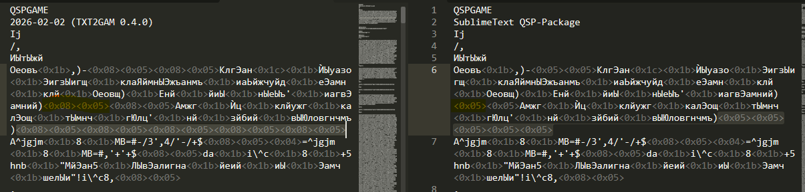

# qsps to QSP

Эти файлы предназначены для проверки работы конвертера. Не самая сложная игра, однако она как нельзя хорошо показывает, соответствует ли формат текущего встроенного конвертера формату конвертера TXT2GAM.

- `ukuzya_old.qsps` - так выглядит игра при конвертировании оригинальной игры из QGen утилитой TXT2GAM
- `ukuzya_txt2gam.qsp` - такая игра получается, если сконвертировать файл `ukuzya_old.qsps` в игру утилитой TXT2GAM. Этот файл ничем не отличается от оригинальной игры.

При конвертировании встроенной утилитой плагина между получившимися файлами игр не должно быть никаких отличий! кроме второй строки.

Если файлы всё же отличаются, скорее всего это из-за того, что встроенный в плагин конвертер не превращает `\n` в `\r\n`, как это делает оригинальная утилита. Проверьте, только ли эти символы изменились. Сделать это легко, т.к. в Sublime Text отображаются коды всех символов:

Меню Sublime Text:

`Tools → Qsp tools → Converters (single files) → QSPS to game`

**Как пользоваться:**

1. Откройте файл `ukuzya_old.qsps` в ST.
2. В меню `Tool` Сублайм Текста выберите последовательно следующие пункты:
	- `Qsp tools`
	- `Converters (single files)` 
	- `QSPS to game`
3. В папке появится файл `ukuzya_old.qsp`, сконвертированный из TXT2GAM.

Таким образом вы можете сконвертировать любой исходник формата TXT2GAM в файл игры.
